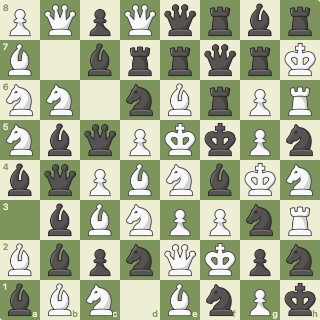
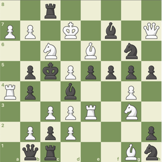
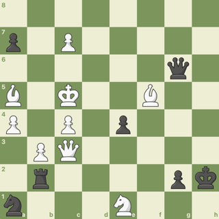

# Chess.com Board Recognizer

Uses a convolutional neural network to recognize the positions of pieces and translate it into FEN format.

If you have an image of a chess.com board as chessboard.png



Run recognizer.py

`python3 recognizer.py chessboard.png`

The Computer will return a link to view the board, accuracy and the FEN format

`Confidence: 99.53%`

`PQpQqrbr/B1brrqrK/NN1nBrPR/NbqPKkPn/bqPBNbKN/1bBNPPnR/BbpnQKpn/bBN1BnPk`

`https://lichess.org/editor/PQpQqrbr/B1brrqrK/NN1nBrPR/NbqPKkPn/bqPBNbKN/1bBNPPnR/BbpnQKpn/bBN1BnPk`

## Sample results

### Randomly generated 32 piece game



Predicted `2r5/PP1K1b1Q/2N1B1n1/1pkPpppp/Rp1b2P1/2PPR1N1/1PpP3p/1qr3Bn`

Confidence `97.75%`

Accuracy `100%`

### Randomly generated 16 piece game



Predicted `8/p1P5/6q1/B1K2B2/P1P1p3/1PQ5/1r4pk/n3N3`

Confidence `99.82%`

Accuracy `100%`

## Getting Started

To use my chessboard recognizer, you will need **ATLEAST** [Python3](https://www.python.org/downloads/) And [Tensorflow 2](https://www.tensorflow.org/)

Set up your enviroment, and then install all required packages

```pip3 install -r requirements.txt```

To use the recognizer, you will need to have a neural network model.

Lucky For you, I've already provided one inside of the folder `nn`

Once you have everything setup, run `recognize.py` with the path of the image you want to identify

`python3 recognize.py chessboard.png`

## Acknowledgements

* Original inspiration from [tensorflow_chessbot](https://github.com/linrock/chessboard-recognizer) by [Elucidation](https://github.com/linrock/)
* Neural network architecture from https://www.tensorflow.org/tutorials/images/cnn
